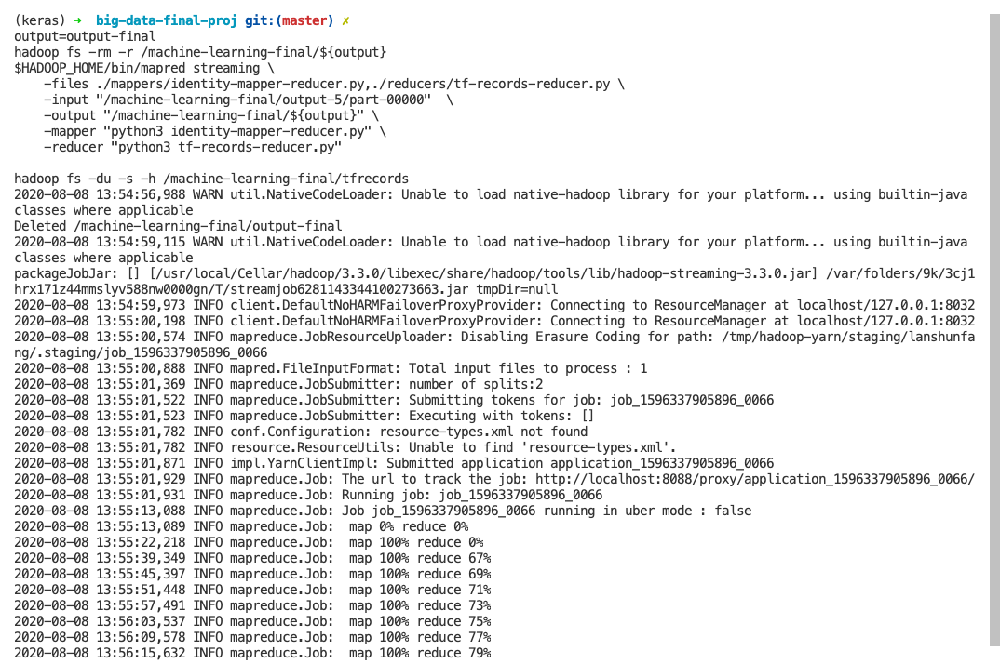

# Machine Learning in Hadoop3 Big Data Framework
Hadoop is capable of processing big data via MapReduce YARN framework in commodity machine clusters.

In the profession of machine learning, when the data is too large, traditional data-processing may become unrealistic thus it may use the effort of big data framework.

## Keyword:
MapReduce, Hadoop, Hadoop Streaming, HDFS, YARN, Machine Learning, Deep Learning, Tensorflow, Distributive Training, Kaggle

## Motivation:
- The training data feeding to the Deep Neural Network (DNN) may be too big to be handled by python science tooling stack
- The data preprocessing like feature engineering, categorical encoding, missing value imputation may not be scalable in a regular single machine.

## Summary
- This project is trying to think at the standpoint of a machine learning developer who wants to utilize Big data framework to ease their daily work
- We will use `Hadoop Streaming` utility to perform training data preprocessing in `Hadoop MapReduce` framework over `HDFS`
  - We will use `python scripts` in Hadoop Streaming as python is the major scripting language for machine learning which has thorough data science tooling stack support
  - We will do the data processing, including:
    - Categorical data encoding
    - Data scaling
    - Missing Data imputation
  - Then we will store the processed CSV Data as TFRecords files in HDFS via Tensorflow TFRecordWriter
    - `TFRecords` is an efficient Tensorflow data format that supports distributive training
    - Tensorflow supports reading `TFRecords` from HDFS with optimized batch size

## Data source
- The data we used here is from [Kaggle - Black Friday sales](https://www.kaggle.com/sdolezel/black-friday?select=train.csv)

## Prerequisites
- macOS Catalina as the development machine
- Homebrew
- Hadoop is setup with `Java 8` as `JAVA_HOME` and `${HADOOP_HOME}` in env variables
  - e.g. `export JAVA_HOME=/Library/Java/JavaVirtualMachines/jdk1.8.0_121.jdk/Contents/Home`
  - e.g. `export HADOOP_HOME=/usr/local/Cellar/hadoop/3.3.0/libexec`

## Data preprocessing with Hadoop Streaming
### Install required packages
```bash
# Upgrade python to python3
brew upgrade python
brew link python
# install tensorflow dependency
pip3 install tensorflow
```

### Categorical Data encoding
> All scripts listed are captured in file `./bin/mapred.sh`

#### Summarize all categorical values/labels for each column

```bash

output=output-0
hadoop fs -rm -r /machine-learning-final/${output}
$HADOOP_HOME/bin/mapred streaming \
    -files ./mappers/categorical-stat-0-mapper.py,./reducers/categorical-stat-0-reducer.py \
    -input "/machine-learning-final/train.csv" \
    -output /machine-learning-final/${output} \
    -mapper "categorical-stat-0-mapper.py" \
    -reducer "categorical-stat-0-reducer.py"

```


```bash
hadoop fs -head "/machine-learning-final/${output}/part-00000"
rm column_encoder_definition.txt
hadoop fs -get "/machine-learning-final/${output}/part-00000" column_encoder_definition.txt
```


#### Encode category data with its number representation (Ordinal/Integer Encoder)
```bash
output=output-1
hadoop fs -rm -r /machine-learning-final/${output}
$HADOOP_HOME/bin/mapred streaming \
    -files hdfs://localhost:9000/machine-learning-final/output-0/part-00000#column_encoder_definition.txt,./mappers/categorical-stat-1-mapper.py \
    -input "/machine-learning-final/train.csv"  \
    -output "/machine-learning-final/${output}" \
    -mapper "categorical-stat-1-mapper.py"

hadoop fs -head "/machine-learning-final/${output}/part-00000"
rm ./target/hadoop_category_encoded.csv
hadoop fs -get /machine-learning-final/${output}/part-00000 ./target/hadoop_category_encoded.csv

```


#### Summarize min/max values per each column
```bash
output=output-2
hadoop fs -rm -r /machine-learning-final/${output}
$HADOOP_HOME/bin/mapred streaming \
    -files ./mappers/identity-mapper-reducer.py,./reducers/min-max-scale-reducer.py \
    -input "/machine-learning-final/output-1/part-00000"  \
    -output "/machine-learning-final/${output}" \
    -mapper "identity-mapper-reducer.py" \
    -reducer "min-max-scale-reducer.py"

hadoop fs -head "/machine-learning-final/${output}/part-00000"
rm ./min_max.json
hadoop fs -get /machine-learning-final/${output}/part-00000 ./min_max.json
```


#### Perform data scaling according to the min/max values
```bash
output=output-3
hadoop fs -rm -r /machine-learning-final/${output}
$HADOOP_HOME/bin/mapred streaming \
    -files hdfs://localhost:9000/machine-learning-final/output-2/part-00000#min_max.json,./mappers/min-max-scale-mapper.py \
    -input "/machine-learning-final/output-1/part-00000"  \
    -output "/machine-learning-final/${output}" \
    -mapper "min-max-scale-mapper.py" 

hadoop fs -head "/machine-learning-final/${output}/part-00000"
```


### Impute missing data with mean values
#### Summarize mean values for each column

```bash
output=output-4
hadoop fs -rm -r /machine-learning-final/${output}
$HADOOP_HOME/bin/mapred streaming \
    -files ./mappers/identity-mapper-reducer.py,./reducers/missing-data-impute-reducer.py \
    -input "/machine-learning-final/output-3/part-00000"  \
    -output "/machine-learning-final/${output}" \
    -mapper "identity-mapper-reducer.py" \
    -reducer "missing-data-impute-reducer.py"

hadoop fs -head "/machine-learning-final/${output}/part-00000"
rm ./means.json
hadoop fs -get /machine-learning-final/${output}/part-00000 ./means.json
```


#### Impute missing data with mean value for each column

```bash

output=output-5
hadoop fs -rm -r /machine-learning-final/${output}
$HADOOP_HOME/bin/mapred streaming \
    -files hdfs://localhost:9000/machine-learning-final/output-4/part-00000#means.json,./mappers/missing-data-impute-mapper.py \
    -input "/machine-learning-final/output-3/part-00000"  \
    -output "/machine-learning-final/${output}" \
    -mapper "missing-data-impute-mapper.py" 

hadoop fs -head "/machine-learning-final/${output}/part-00000"
rm ./target/imputed.csv
hadoop fs -get /machine-learning-final/${output}/part-00000 ./target/imputed.csv
echo 'User_ID,Product_ID,Gender,Age,Occupation,City_Category,Stay_In_Current_City_Years,Marital_Status,Product_Category_1,Product_Category_2,Product_Category_3,Purchase' > ./target/training_final.csv
cat ./target/imputed.csv >> ./target/training_final.csv
head ./target/training_final.csv
```


### Save CSV data as Tensorflow TfRecords in HDFS
```bash

output=output-final
hadoop fs -rm -r /machine-learning-final/${output}
$HADOOP_HOME/bin/mapred streaming \
    -files ./mappers/identity-mapper-reducer.py,./reducers/tf-records-reducer.py \
    -input "/machine-learning-final/output-5/part-00000"  \
    -output "/machine-learning-final/${output}" \
    -mapper "python3 identity-mapper-reducer.py" \
    -reducer "python3 tf-records-reducer.py"

hadoop fs -du -s -h /machine-learning-final/tfrecords
```



# What's Next
- After the data preprocessing, now we could start Tensorflow distributive training. The sub-project is hosted in `./distributive-training/`

# Reference:

### Data source
- Dolezel, S. (2018, January 21). Black Friday. Retrieved August 08, 2020, from https://www.kaggle.com/sdolezel/black-friday?select=train.csv

### Hadoop streaming with Python
- Hadoop-team, H. (2020). Hadoop Streaming. Retrieved August 08, 2020, from https://hadoop.apache.org/docs/current/hadoop-streaming/HadoopStreaming.html
- Noll, M. G. (2013). Writing An Hadoop MapReduce Program In Python. Retrieved August 08, 2020, from https://www.michael-noll.com/tutorials/writing-an-hadoop-mapreduce-program-in-python/

### HDFS with Tensorflow
- Standy, S. (2017, June 01). Tensorflow create a tfrecords file from csv. Retrieved August 08, 2020, from https://stackoverflow.com/questions/41402332/tensorflow-create-a-tfrecords-file-from-csv
- Alibaba-Cloud, E. (2019). Prepare TensorFlow training data by using TFRecord and HDFS. Retrieved August 08, 2020, from https://partners-intl.aliyun.com/help/doc-detail/53928.htm
- CSDN, 零. (2020, May). Use Hadoop Streaming to generate distributive TFRecord files. Retrieved August 08, 2020, from https://blog.csdn.net/cdj0311/article/details/105991138

# Appendix
- Will attach another PDF
- [Online Github repo link](https://github.com/lanshunfang/hadoop3-tensorflow-big-data-machine-learning)


